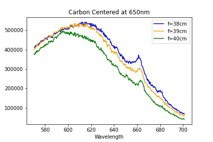

# BSc-Research-Project

This python program was one of many used for calibrating and analysing spectral profiles of plasma plumes taken from a variety of target material. This example specifically was used for a carbon (graphite) target, with the spectrometer centered at a wavelength of 650nm. It should be noted that the beginning of this code uses Neon and Krypton calibration lamps to calibrate the wavelengths (x-axis of final plots) and  QTH lamp to calibrate the relative intensities measured in the spectrometer (y-axis in the final plot). For different spectrometers, center wavelengths, and calibration lamps, the calculations of emission peaks will have to be adjusted accordingly.

The final spectral profile for the carbon data from this example is shown below:

