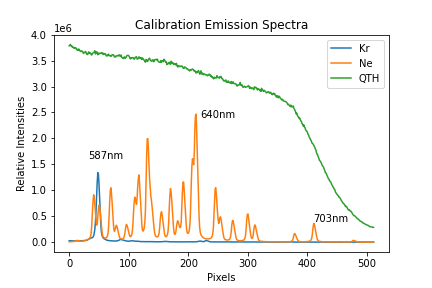
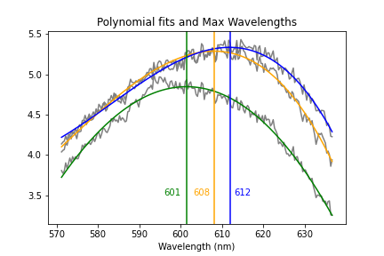

# BSc-Research-Project

This python program was one of many used for calibrating and analysing spectral profiles of plasma plumes taken from a variety of target material. This example specifically was used for a carbon (graphite) target, with the spectrometer centered at a wavelength of 650nm. It should be noted that the beginning of this code uses Neon and Krypton calibration lamps to calibrate the wavelengths (x-axis of final plots) and  Quartz-Tungsten-Halogen (QTH) lamp to calibrate the relative intensities measured in the spectrometer (y-axis in the final plot). For different spectrometers, center wavelengths, and calibration lamps, the calculations of emission peaks will have to be adjusted accordingly.

## How it Works

This program was made to take in data in the form of .tiff files. These files are pixel arrays (images), in this case 78x512, with each pixel storing a "count" or relative intensity of photons incident on that pixel. Because the images are taken after the light passes through a spectrometer, the x-axis of these images correspond to wavelengths.

This program works in three main steps:
1 - Calibrate wavelengths by making a relation between x-pixel number and a wavelength
2 - Calibrate the relative intensities by creating a correction ration from a "known" spectral profile (the QTH lamp)
3 - Apply these calibrations to the real data and plot the calibrated data
4 - Calculate a peak wavelength and corresponding temperature (via Wein's law) of each plasma

Details of these steps can be found below.

## Wavelength Calibration

The wavelength calibration acts as a relation between x-axis pixels and wavelengths. It is done by identifying known emission lines from the Neon and Krypton lamps, then using those points to build

 - The first step in the wavelength calibration is to load in the calibration data (three .tiff files: Ne, Kr, and QTH) and put it into 1-D arrays by summing over the y-axis intensities.
 - The next step is to calculate the pixel values of emission lines from the Neon and Krypton lamp that occur at "known" wavelengths. This is done by calculating the centriod of a region in which the emission line lies, and let's us relate pixel locations to wavelength locations. The three emission lines calculated here are Krypotn's 587nm line, and Neon's 640nm and 703nm lines, seen in the figure below.
 - The final step is to use these three points to make a second degree polynomial, stored as an array, to act as the relationship between pixel and wavelength.

## Relative Intensity calibration

To calibrate the intensity of the experimental data, the QTH lamp is used. This lamp has a very well known/measured emission spectrum over the wavelength region of interest, so it can serve as an indicator of how accurate the measured intensities/counts from the images are, and if it is over or under detecting intensity in every region.

 - This calculation starts off by creating an array that corresponds to the NIST polynomial, which is just a polynomial form of the known QTH emission spectrum. This polynomial, along with the measured QTH spectrum are then normalized to unity.
 - Lastly, a "ratio of calibration" is calculated by dividing the MEASURED emission spectrum of the QTH lamp by the KNOWN emission spectrum (the NIST polynomial). This can then be easily applied to the real data (by dividing the real data by this ratio) to ensure the relative intensities measured by the spectrometer are accurate.

## Calibrate and Plot Real Data

The last part of this code is to use the two calibrations on the real data, plot it, and calculate the maximum wavelengths.

 - This is done by loading in the real data, which are three additional .tiff files (each corresponding to a different event) plus an extra background .tiff file. The background image is taken with all the lights in the room switched off and serves as a control which gets subtracted out of the data of interest. A sum was then done over the vertical pixels to make each image into a 1-D array.
 - Then the intensity calibration was applied by dividing the real data arrays by the "ratio of calibration", and finally the data was plotted with the wavelenth function as the x-axis. This plot can be seen below.

## Calculate Max Wavelength and plot

To calculate the peaks of each emission line, a third degree polynomial fit was applied to the region right around the peak of each emission spectrum, and the location of the max was recorded. These polynomials can be seen below, along with the data plots and the maximum wavelengths.

To calculate the temperatures, a simple calculation was performed of Wein's law relating max wavelength to temperature.

